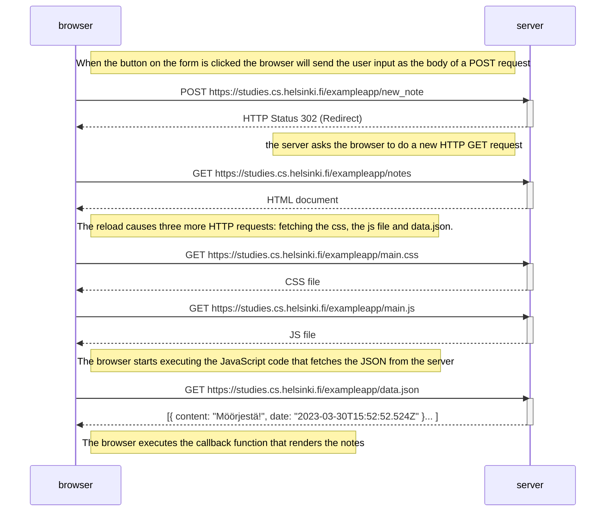

```mermaid
sequenceDiagram
    participant browser
    participant server
    Note right of browser: When the button on the form is clicked the browser will send the user input as the body of a POST request
    browser->>server: POST 	https://studies.cs.helsinki.fi/exampleapp/new_note
    activate server
    server-->>browser: HTTP Status 302 (Redirect)
    deactivate server
    Note left of server: the server asks the browser to do a new HTTP GET request
    browser->>server: GET https://studies.cs.helsinki.fi/exampleapp/notes
    activate server

    server-->>browser: HTML document
    deactivate server
    Note right of browser:The reload causes three more HTTP requests: fetching the css, the js file and data.json.
     browser->>server: GET https://studies.cs.helsinki.fi/exampleapp/main.css
    activate server
    server-->>browser: CSS file
    deactivate server

    browser->>server: GET https://studies.cs.helsinki.fi/exampleapp/main.js
    activate server
    server-->>browser: JS file
    deactivate server

    Note right of browser: The browser starts executing the JavaScript code that fetches the JSON from the server

    browser->>server: GET https://studies.cs.helsinki.fi/exampleapp/data.json
    activate server
    server-->>browser: [{ content: "Möörjestä!", date: "2023-03-30T15:52:52.524Z" }... ]
    deactivate server

    Note right of browser: The browser executes the callback function that renders the notes
```