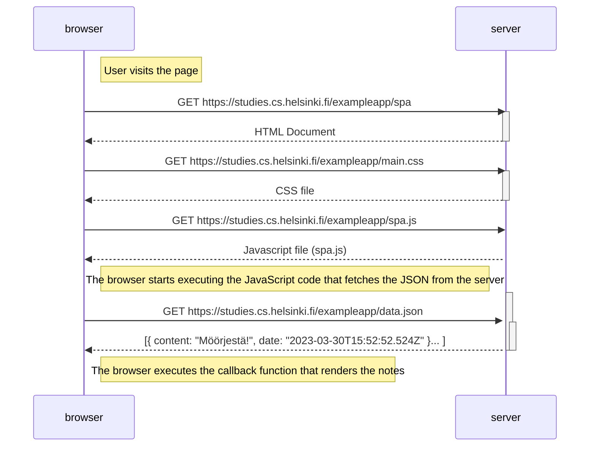

```mermaid
sequenceDiagram
    participant browser
    participant server
    Note right of browser: User visits the page
    browser->>server: GET 	https://studies.cs.helsinki.fi/exampleapp/spa
    activate server
    server-->>browser: HTML Document
    deactivate server

    browser->>server:   GET https://studies.cs.helsinki.fi/exampleapp/main.css
    activate server
    server-->>browser: CSS file
    deactivate server
    browser->>server: GET https://studies.cs.helsinki.fi/exampleapp/spa.js
    activate server
    server-->>browser: Javascript file (spa.js)

    Note right of browser: The browser starts executing the JavaScript code that fetches the JSON from the server
    activate server
    browser->>server: 	GET https://studies.cs.helsinki.fi/exampleapp/data.json
    activate server
    server-->>browser: [{ content: "Möörjestä!", date: "2023-03-30T15:52:52.524Z" }... ]
    deactivate server
    deactivate server
    Note right of browser: The browser executes the callback function that renders the notes
```