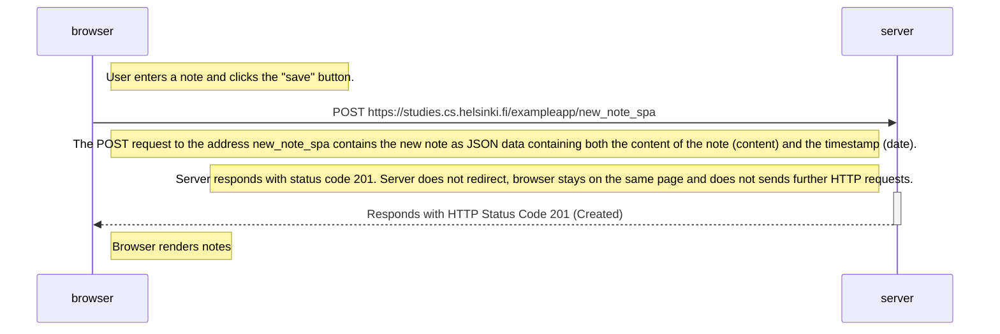

```mermaid
sequenceDiagram
    participant browser
    participant server
    Note right of browser: User enters a note and clicks the "save" button.
   
    browser->>server: POST	https://studies.cs.helsinki.fi/exampleapp/new_note_spa
    Note right of browser: The POST request to the address new_note_spa contains the new note as JSON data containing both the content of the note (content) and the timestamp (date).
    Note left of server: Server responds with status code 201. Server does not redirect, browser stays on the same page and does not sends further HTTP requests.
    activate server
    
    server-->>browser: Responds with HTTP Status Code 201 (Created)
    deactivate server
    Note right of browser: Browser renders notes 
```
